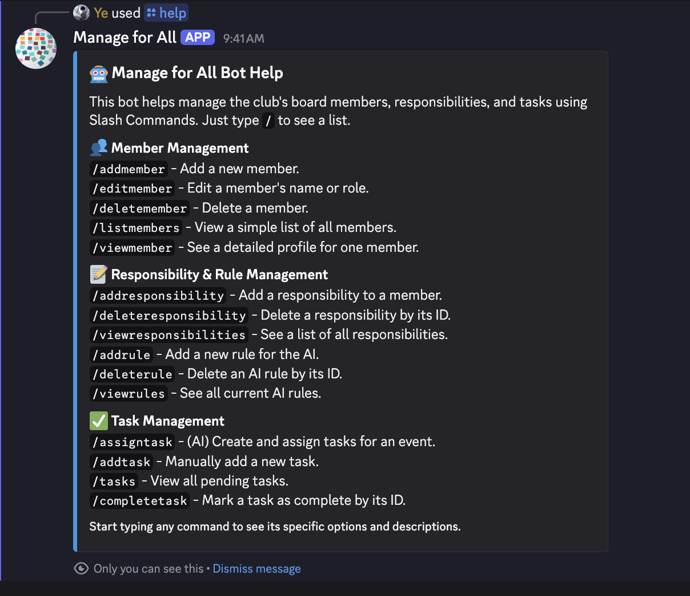

# Manage For All or Club Management & Task Assignment Discord Bot

## Overview

Manage For All is a discord bot that can assgin tasks to board members of a club based on their roles and responsibilities using Gemini. You can also add rules or instructions about how should the bot assign tasks to the members.

## Technology Stack

- Language: Python

- Database: PostgreSQL

- AI: Gemini API

- Other: Discord API, Docker

## Example Command

## Current Features

### Member Management

`/addmember `- Add a new member.

`/editmember` - Edit a member's name or role.

`/deletemember` - Delete a member.

`/listmembers` - View a simple list of all members.

`/viewmember` - See a detailed profile for one member.

### Responsibility & Rule Management

`/addresponsibility` - Add a responsibility to a member.

`/deleteresponsibility` - Delete a responsibility by its ID.

`/viewresponsibilities` - See a list of all responsibilities.

`/addrule` - Add a new rule for the AI.

`/deleterule` - Delete an AI rule by its ID.

`/viewrules` - See all current AI rules.

### Task Management

`/assigntask` - (AI) Create and assign tasks for an event.

`/addtask` - Manually add a new task.

`/tasks` - View all pending tasks.

`/completetask` - Mark a task as complete by its ID.

## Upcoming Feautres

- Ability to edit the task, rule and responsibility

- Replace name with discord username to be able to mention

- Modify the database so that it can be used in different servers

- Implement meeting scheduling and notification via DM

- Moving the hosting to cloud from personal server
